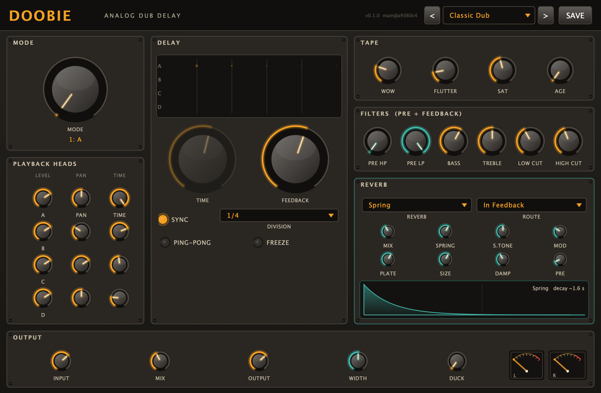
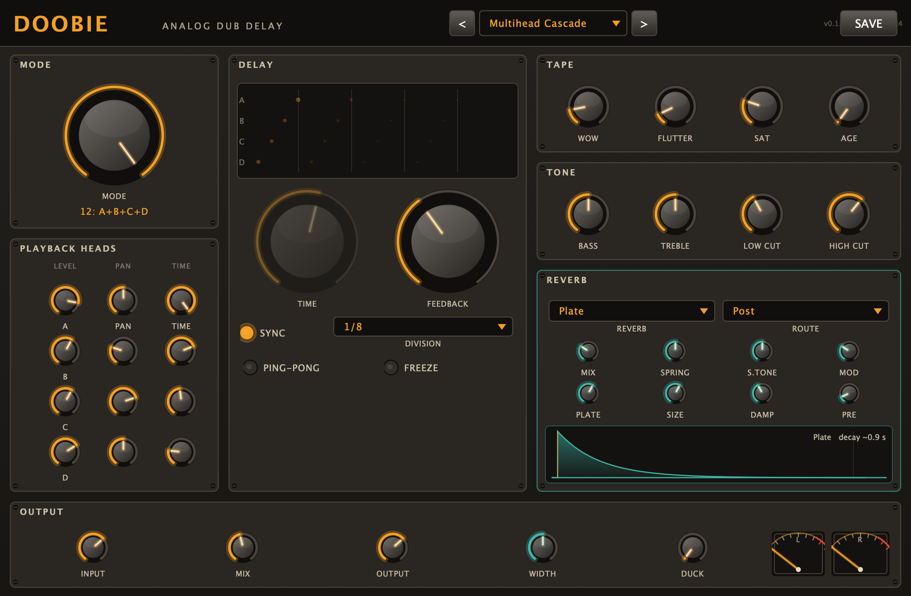
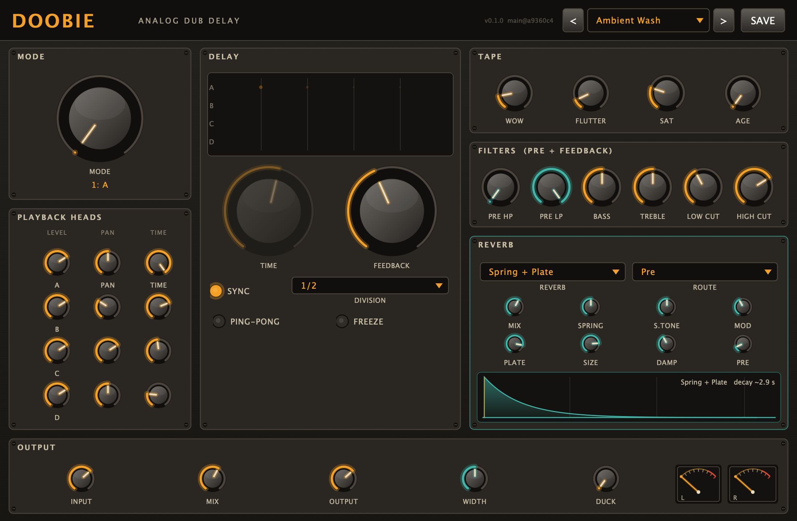
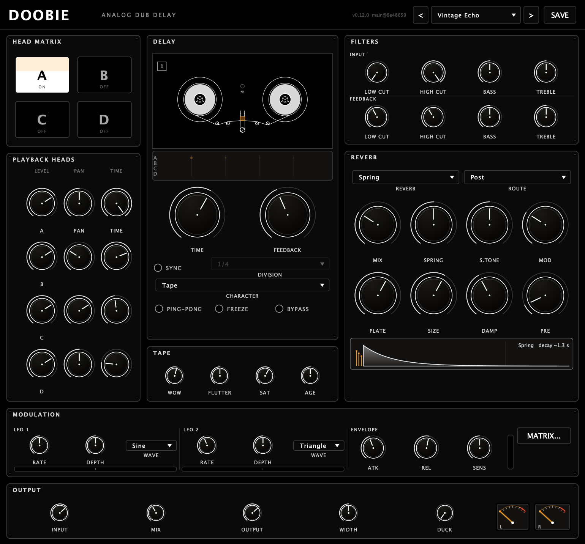

<div align="center">

# Doobie

### Analog dub delay — VST3 · AU · Standalone

A stereo multi-head tape echo with tape saturation, wow & flutter, in-loop tone
shaping, and a chained spring + plate reverb. Built for classic dub, equally at
home as a modulated delay and ambience for any genre.




</div>

## Highlights

- **Multi-head tape echo** — four playback heads tapping one tape, each with its
  own level, pan and time. In sync each head's time snaps to a musical division
  (1/32 … 1/1) so taps land on the grid; free-running, it's a continuous fraction
  of the repeat. A four-pad **head matrix** switches each head in or out
  independently for any combination of taps, and switching is click-free — heads
  ramp in and out instead of cutting dead.
- **Five delay characters** — Digital (clean), Tape (wow/flutter + saturation),
  BBD (dark analog bucket-brigade), Diffuse (repeats smeared into a wash) and
  Pitch (each repeat climbs an octave).
- **Free or tempo-synced** — free time (20 ms – 8 s) or musical divisions from 1/64
  up to 4 bars (dotted and triplet included), locked to the host. The tape buffer
  goes out to 16 s, so "4 bars at 60 BPM" or slower ambient drones fit comfortably.
  Division and sync changes glide like a tape capstan rather than jumping.
- **Analog character** — tape saturation, wow & flutter with random drift, and an
  **AGE** macro that wears the tape down: hiss, slow level dropouts, progressive
  high-frequency loss and extra transport instability, compounding across repeats.
- **Two independent filter stages** — an **input** filter (low-cut, high-cut, bass
  and treble) shapes only the signal that gets echoed, leaving the dry output clean;
  a separate **feedback** filter (same four controls) darkens and dissolves each
  repeat the way real tape does. Each stage has its own dedicated knobs.
- **Seven reverb modes** — a dispersive spring tank, a modulated plate, a dense
  16-line **hall**, an octave-up **shimmer**, plus spring→plate series and
  spring+plate parallel. Route any of them **post**, **pre**, or **inside the
  feedback loop** for washing dub textures and blooming ambient tails.
- **Performance controls** — ping-pong feedback, freeze (infinite hold), wet ducking,
  stereo width.
- **60+ factory presets** across dub/reggae, ambient/cinematic, rhythmic/electronic,
  lo-fi/vintage, hall & shimmer, delay characters, sound-design FX and instrument
  patches, plus user save/load.
- **Vintage UI** — brushed-metal panel, amber-lit knobs, analog VU meters, a live
  per-head echo visualiser, and a reverb decay-curve display.

## Screenshots

<div align="center">

| Multi-head, plate reverb | Ambient wash (spring + plate) | Lo-fi vintage echo |
|:---:|:---:|:---:|
|  |  |  |

</div>

The echo visualiser (top of the DELAY panel) shows each active head's tap pattern
and the repeats decaying by the feedback amount. The reverb panel's decay curve
shows the active reverb's tail length and pre-delay at a glance.

## Getting dub sounds

- **Long dark echoes:** sync to 1/4, FEEDBACK ~0.7, pull HIGH CUT down to ~3 kHz so
  repeats get darker each pass; add a little SATURATION.
- **Spring crashes / wash:** set REVERB to *Spring* and ROUTE to *In Feedback* — the
  reverb builds across repeats. Ride REVERB MIX.
- **Siren feedback:** push FEEDBACK to ~1.0 and ride the LOW CUT / HIGH CUT.
- **Freeze a moment:** hit FREEZE to hold the buffer infinitely, then play over it.

## Building

Requires CMake ≥ 3.22 and a C++20 toolchain. JUCE is vendored as a git submodule.

```sh
git clone --recurse-submodules https://github.com/DatanoiseTV/doobie.git
cd doobie
cmake -B build -G Ninja -DCMAKE_BUILD_TYPE=Release
cmake --build build --target Doobie_All
```

Already cloned without submodules? `git submodule update --init --recursive`

For a fast single-architecture build add `-DCMAKE_OSX_ARCHITECTURES=arm64` (or
`x86_64`); the default produces a universal binary on macOS. Built plugins are
copied to the system plugin folders, and the standalone app lands in
`build/Doobie_artefacts/<config>/Standalone/`.

## Tests

```sh
cmake --build build --target doobie_tests
ctest --test-dir build
```

Tests cover the framework-independent DSP cores (delay line, saturation, spring and
plate stability/decay, wow/flutter). The Audio Unit also passes Apple's `auval`.

## Project layout

DSP lives in `src/dsp`, the UI in `src/ui`, presets in `src/presets`, and the JUCE
plugin glue in `src/PluginProcessor.*` / `src/PluginEditor.*`. `tools/Snapshot.cpp`
renders the editor to a PNG offline (used for the screenshots above).

## License

Copyright © 2026 **DatanoiseTV**.

Doobie is free software, licensed under the **GNU General Public License v3.0**
(see [LICENSE](LICENSE)). In short: you may use, study, modify and redistribute it,
but any distributed version or derivative **must be released under the GPLv3 with
full source code**, and **must keep this attribution to DatanoiseTV**.

GPLv3 is required because Doobie links the [JUCE](https://juce.com) framework under
its GPLv3 option. Building Doobie into a closed-source product would require a
commercial JUCE license.
